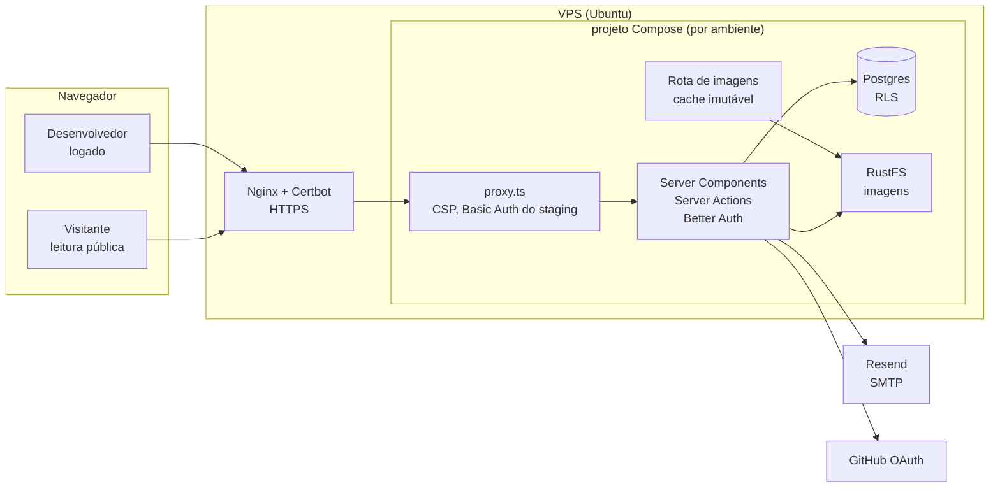

# 04 — Arquitetura

> Status: decisões do usuário de 2026-10-05 e 2026-10-06 · Última atualização: 2026-10-06 · Decisões em [decisoes/](decisoes/)
>
> A base é a mesma do Orçô (projeto irmão, já em produção), para reaproveitar o que já funciona.

## Stack

| Camada | Escolha | Origem |
|---|---|---|
| Framework | **Next.js 16** (App Router, Turbopack) com React 19, Server Components e Server Actions. No Next 16, o antigo `middleware.ts` chama-se **`proxy.ts`** | P1-A, [ADR-0001](decisoes/0001-stack.md) |
| Linguagem e runtime | TypeScript `strict`, **Node 24 LTS**, **npm** | P1-A |
| Interface | Tailwind CSS 4, shadcn/ui e lucide-react; cores e fontes pelos tokens do [12-identidade-visual.md](12-identidade-visual.md) | P1-A, F6-A |
| Formulários e validação | React Hook Form e Zod (os mesmos schemas no navegador e no servidor) | P1-A |
| Banco | **PostgreSQL 17**, um por ambiente | P2-A, [ADR-0003](decisoes/0003-banco-drizzle-rls-roles.md) |
| Acesso ao banco e migrations | **Drizzle** e `drizzle-kit` (migrations SQL revisadas no PR) | P2-A |
| Autorização | **RLS** em todas as tabelas, com roles separadas | S1-A, [ADR-0003](decisoes/0003-banco-drizzle-rls-roles.md) |
| Autenticação | **Better Auth**: GitHub, e-mail e senha, confirmação, recuperação, vínculo de contas; sessões no Postgres | N1-C, P3-A, [ADR-0002](decisoes/0002-auth-better-auth.md) |
| Arquivos | **RustFS** (compatível com S3) via `@aws-sdk/client-s3`; imagens processadas pelo **sharp** | P6-A, I4-A, [ADR-0004](decisoes/0004-imagens-rustfs-sharp.md) |
| Markdown | Renderização no servidor, sem HTML bruto e sem imagens externas | P7-B, S8-A, [ADR-0005](decisoes/0005-markdown-seguro.md) |
| E-mail | **Nodemailer + SMTP**: Mailpit no local, Resend no staging e na produção | I5-A, [ADR-0006](decisoes/0006-email-smtp.md) |
| Limites de uso | Tabela e função no Postgres | S4-A, S5-A |
| Testes | Vitest (unidade e integração com banco real) e Playwright (E2E) | P4-A |
| Qualidade e segurança do código | ESLint, Prettier, GitHub Actions, CodeQL, Dependabot, secret scanning | F1-A, [ADR-0009](decisoes/0009-github-ci-codeql-dependabot.md) |
| Hospedagem | **VPS própria** (a mesma do Orçô) com **Docker Compose**, **Nginx e Certbot**; imagens no **GHCR**; deploy por SSH a partir do GitHub Actions | I2-A, [ADR-0007](decisoes/0007-hospedagem-vps.md) |
| Versões | SemVer escolhido pelo usuário; tag `vX.Y.Z` por `gh release create` → `production.yml` | F4-A, [ADR-0008](decisoes/0008-versionamento-releases-e-em-breve.md) |

**Fora por ora:** Sentry, CAPTCHA, serviço de busca separado (a busca usa o próprio Postgres), fila de tarefas.

## Visão geral



## Estrutura de pastas (prevista)

```
/
├── docs/                      documentação (fonte da verdade do conteúdo)
├── db/
│   ├── bootstrap/             roles (rodado uma vez por banco novo)
│   └── migrations/            SQL gerado pelo drizzle-kit e revisado
├── deploy/                    compose.yaml, deploy.sh, site do Nginx, env.example, README
├── Dockerfile                 imagem do app (standalone, não-root)
├── compose.dev.yaml           local: Postgres, RustFS e Mailpit
├── src/
│   ├── app/
│   │   ├── (auth)/            /entrar, /cadastro, /recuperar-senha, /redefinir-senha
│   │   ├── projetos/          /projetos/[id], /projetos/novo, /projetos/[id]/editar
│   │   ├── [usuario]/         perfil público /@usuario (o formato da rota será decidido na M1)
│   │   ├── perfil/            editar o meu perfil
│   │   ├── notificacoes/
│   │   ├── admin/
│   │   └── api/               rotas do Better Auth e das imagens
│   ├── components/
│   │   ├── ui/                shadcn/ui (gerado)
│   │   └── ...                componentes do produto
│   ├── features/              projects/, updates/, comments/, reactions/, notifications/, reports/, profile/
│   │   └── <feature>/         actions.ts, queries.ts, schemas.ts (Zod), components/
│   ├── lib/
│   │   ├── db/                schema Drizzle, clientes por role, withUserDb (server-only)
│   │   ├── auth/              Better Auth e helpers de sessão (server-only)
│   │   ├── email/             Nodemailer e modelos em pt-BR (server-only)
│   │   ├── storage/           cliente S3 do RustFS (server-only)
│   │   ├── images/            processamento com o sharp (server-only)
│   │   └── markdown/          renderização segura
│   └── proxy.ts               CSP com nonce, Basic Auth do staging, "Em breve" na produção
├── tests/
│   ├── unit/                  Vitest, sem banco
│   ├── integration/           Vitest contra Postgres e RustFS reais
│   └── e2e/                   Playwright
├── .github/                   workflows, dependabot, templates
└── CLAUDE.md
```

## Padrões de fluxo

**Leitura pública:** Server Component → consulta pela role do app, sem usuário na transação → a RLS libera só o que é público (conteúdo não removido, autor não bloqueado) → renderiza. O navegador nunca fala com o banco.

**Mutação:** formulário (RHF e Zod no navegador, só para a experiência) → **Server Action** → valida de novo com o mesmo schema → confere a sessão e o e-mail confirmado (RN-03) → confere o limite de uso (RN-38) → `withUserDb(userId, …)` (RLS) → `revalidatePath`.

**Upload de imagem:** Server Action → confere a sessão, o tipo pelos primeiros bytes e o tamanho → **sharp** (WebP até 1920 px, sem metadados, miniatura de 400 px) → RustFS com nome aleatório (UUID) → grava a referência no banco.

**Exibição de imagem:** `GET /api/imagens/[arquivo]` → confere no banco se a imagem pertence a um conteúdo visível → lê do RustFS → `Cache-Control: public, max-age=31536000, immutable`. Se o conteúdo for removido pela moderação, a rota deixa de servir a imagem (I4-A).

**Em alta (RN-29):** consulta que soma as reações e 2 × os comentários dos últimos 7 dias por projeto. Se ficar lenta, vira uma tabela recalculada de tempos em tempos (decisão futura).

## Convenções de nomes

- Código, banco, tipos e identificadores em **inglês** (`projects`, `life_support`, `comments`).
- Tudo o que o usuário vê em **pt-BR**: textos e **URLs** (`/projetos/novo`).
- Os nomes técnicos dos estados ficam em [11-mapa.md](11-mapa.md).
