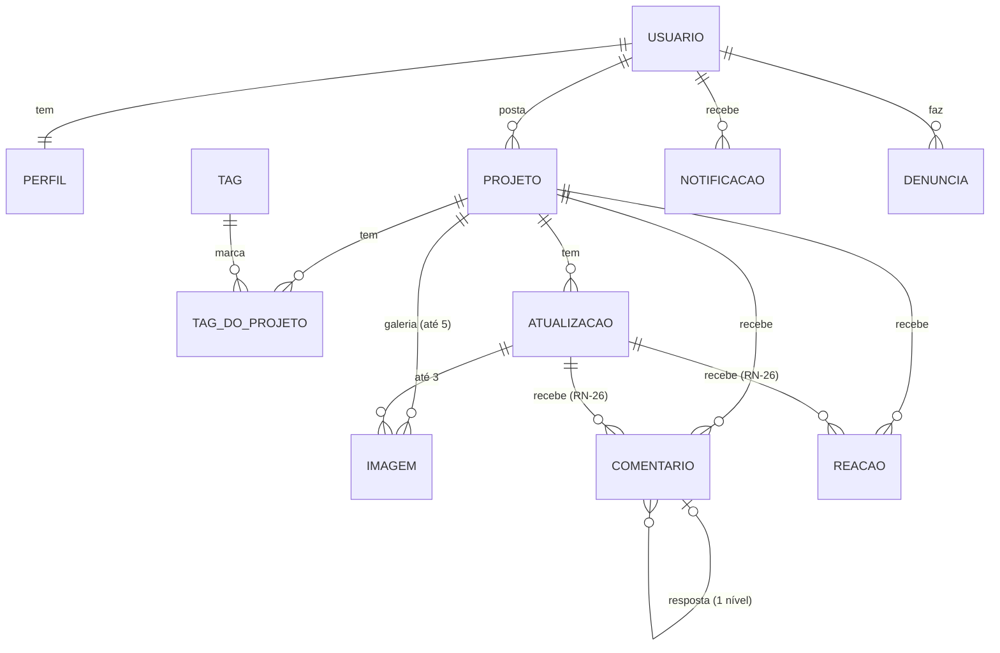

# 11 — Mapa do negócio

> Status: rascunho para validação · Última atualização: 2026-10-06

## Atores

| Ator | Autenticado? | O que faz |
|---|---|---|
| **Visitante** | Não | Lê o feed, os projetos e os perfis (RN-27). |
| **Desenvolvedor** | Sim, com e-mail confirmado (RN-03) | Posta e gerencia os próprios projetos e atualizações, comenta, reage e denuncia. |
| **Admin** | Sim, `role = 'admin'` | Tudo o que o desenvolvedor faz, e moderar denúncias (RN-35). |
| **Sistema** | — | Processa imagens, calcula o "em alta", gera notificações e aplica os limites de uso. |

## Entidades e relações

Modelo físico em [05-dados.md](05-dados.md), detalhado na fase de cada entidade.

## Estados do projeto (RN-11)

O autor muda o estado livremente, em qualquer direção.

| Estado (UI) | Valor técnico | Quando usar |
|---|---|---|
| 🫁 Respirando por aparelhos | `life_support` | quase desistindo |
| 🪦 Abandonado | `abandoned` | parado |
| 🔎 Procurando equipe | `seeking_team` | parado, mas aberto a quem quiser ajudar |
| 🧟 Revivido | `revived` | voltou à ativa |

## Mapa de telas (⏳ proposto)

URLs em pt-BR.

| URL | Tela | Login? |
|---|---|---|
| `/` | Feed (Recentes / Em alta), busca e filtros | não |
| `/projetos/[id]` | Projeto: galeria, descrição, motivo, atualizações, comentários, reações | não |
| `/projetos/novo` | Postar projeto | sim |
| `/projetos/[id]/editar` | Editar projeto | autor |
| `/@[usuario]` | Perfil público | não |
| `/perfil` | Editar o meu perfil, avatar, excluir conta | sim |
| `/notificacoes` | Lista de notificações | sim |
| `/entrar`, `/cadastro`, `/recuperar-senha`, `/redefinir-senha` | Conta | não |
| `/admin` | Denúncias | admin |
| `/termos`, `/privacidade` | Documentos legais (M6) | não |

> ⚠️ PENDENTE: o formato do endereço do projeto (só o id, ou id e nome, como `/projetos/a1b2-meu-app`). Decidir na M2.

## Glossário

| Termo | Significado |
|---|---|
| **Enterrar** | Postar um projeto abandonado. |
| **Reviver** | Retomar um projeto (estado 🧟 Revivido). |
| **Atualização** | Post do autor contando o progresso de um projeto. |
| **Em alta** | Feed ordenado pela interação dos últimos 7 dias (RN-29). |
